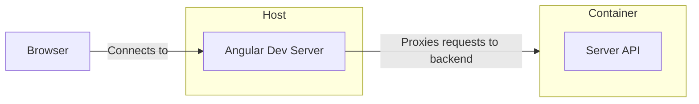

# AngularWithDocker

This repo demonstrates the steps to integrate an angular in an ASP.NET host running in docker. When running in development, the flow is as follows:

* Angular developer proxy serves the app and runs on the host machine.
* Backend API runs inside the container and receives proxied requests from the app.

The target inside `ClientApp/proxy.conf.js` needs to be updated to target the container URL.
